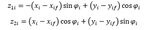

# multirobot-formation-control
Problem is defined as follows:
Suppose you have a set of differential wheeled robots. You want them to be located in a predefined formation, but you can send them only two variables to ALL robots: Angular and linear velocity.

The robots all have a different distance from wheel to wheel. This is crucial to make the system of n robots controllable under only 2 variables. A little proof can be found in MRControl_original.pdf.

Problem is solved with a change of variable, a constant angular velocity for all robots, and a LQR control applied to the new system (which is linear). So the important part of the problem solving is the key change of variables, this is valid in general to all differential wheeled robots. We start from the classic equations: 

And we make a magic change of variables as follows: 

This variables form a dynamical subsystems of 2 variables from a system of 3. So control is by far easier. The "lost" variable is the orientation of the robot, which doesn't matter in the problem of formation of the robots (only "x" and "y" are important)

Let's note that in strict sense this is not optimal LQR because it can be "even more optimal" if we choose better the angular velocity. But this will be non-linear optimal control, a piecewise variable angular velocity is commented in code.
Simulation is showed in MATLAB script with graphics.
